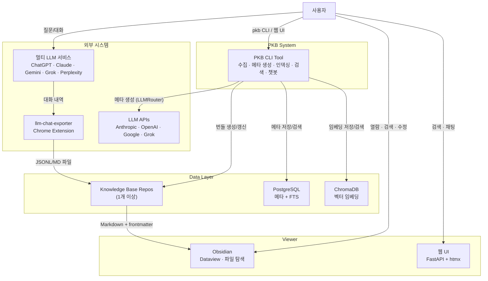
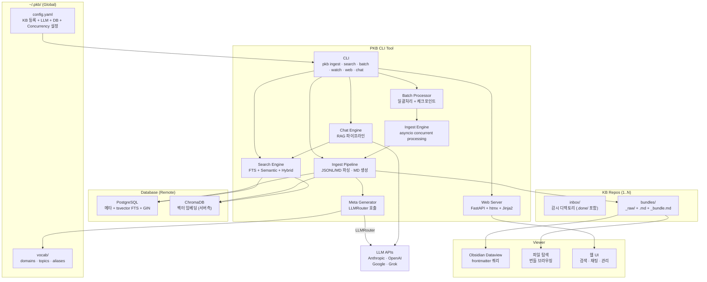
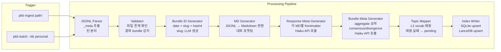
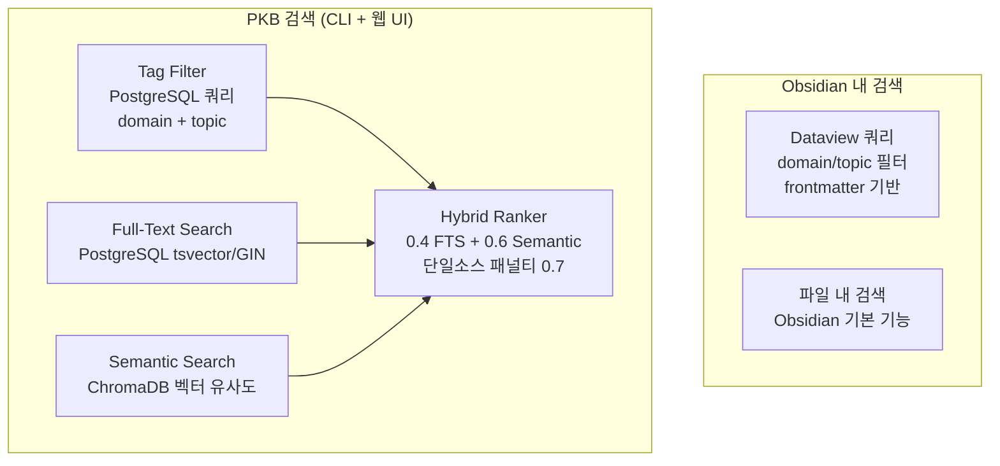
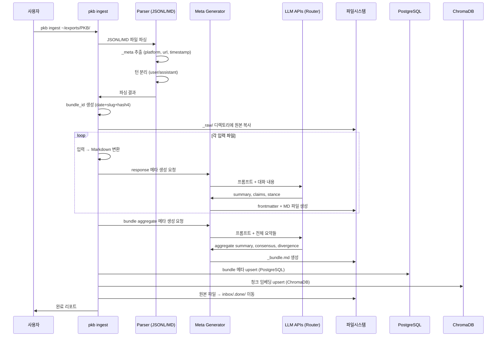
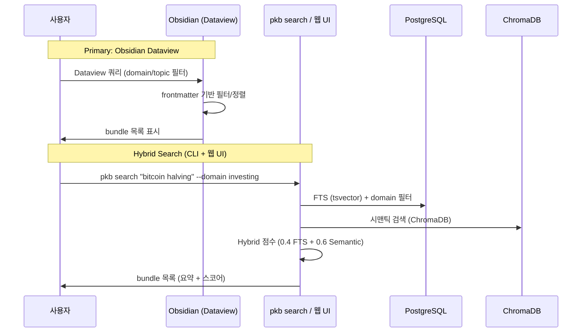
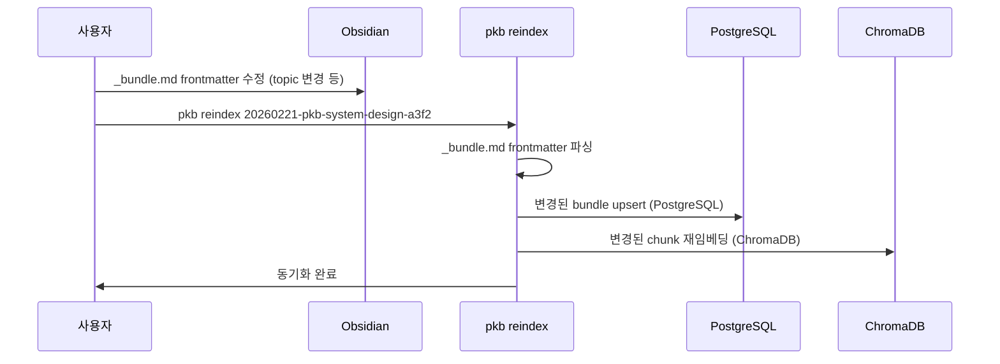

# PKB (Private Knowledge Base) — Unified Design Document v1.0

> 5개 LLM 설계안(ChatGPT, Claude, Gemini, Grok, Perplexity)을 통합하고,
> 추가 설계 결정사항을 반영한 최종 설계 문서.

---

## 1. 프로젝트 개요

### 1.1 문제 정의

멀티-LLM 비교 질문 워크플로우에서 **후처리(export → 저장 → 정리)가 병목**.
축적된 대화 데이터가 검색/연결/재활용 불가능한 "죽은 도서관" 상태.

### 1.2 목표

- **정리 시간 ≈ 0**: exporter 실행 후 메타데이터 자동 생성
- **검색 가능한 지식**: 태그 필터 + 시맨틱 검색
- **쉬운 열람**: Obsidian (Dataview) 기반 뷰어
- **쉬운 수정**: derived만 편집, raw(JSONL)는 불변
- **멀티-KB 지원**: 여러 knowledge base 디렉토리를 독립 repo로 관리

### 1.3 비목표 (MVP 제외)

- ~~웹 UI, RAG 챗봇~~ (Phase 4에서 구현 완료)
- 태그 그래프/온톨로지 구축
- 멀티유저 권한 관리

### 1.4 용어 정의

| 용어 | 의미 |
|------|------|
| **Bundle** | 하나의 질문 세션 산출물 전체 (질문 + 다중 LLM 응답). 저장/검색의 기본 단위 |
| **Raw** | exporter가 출력한 JSONL 파일. 불변(immutable) |
| **Derived** | 시스템이 생성하거나 사용자가 편집한 파일(MD, _bundle.md). 재생성 가능 |
| **Domain (L1)** | 고정 카테고리 8개 (개발, 투자, 학습, 건강, 취미, 자기성찰, 사이드프로젝트, 업무) |
| **Topic (L2)** | Controlled vocabulary. LLM 매핑 + 수동 승인 |
| **PKB** | 이 도구/스크립트 리포지토리 |
| **KB** | Knowledge Base. 번들이 저장되는 데이터 디렉토리 (별도 repo) |

---

## 2. 설계 결정 사항

5개 설계안에서 의견이 갈린 지점들에 대한 확정 결정.

| # | 결정 사항 | 확정 | 근거 |
|---|-----------|------|------|
| AD-01 | 메타 생성 LLM | Phase 1-3: Haiku 단독. Phase 4.5: 멀티 프로바이더 라우팅 도입 ✅ | Tier 기반 라우팅 (Anthropic, OpenAI, Google, Grok) + 에스컬레이션 |
| AD-02 | Bundle ID 형식 | `YYYYMMDD-slug-hash4` | Obsidian 파일 탐색에서 사람이 읽기 쉬움 |
| AD-03 | 메타데이터 저장 | 각 MD에 frontmatter + `_bundle.md`(aggregate) | Obsidian Dataview 호환 + aggregate 메타는 한 곳에만 |
| AD-04 | 태그 계층 | 2-tier (L1 Domain 8개 + L2 Topic) | L3 Facet은 벡터 검색이 대체. MVP 복잡도 통제. 초기 10개→8개 통합 |
| AD-05 | VectorDB | ~~LanceDB~~ → **ChromaDB (원격)** | 서버측 임베딩(기본) 또는 TEI 클라이언트측(bge-m3, 1024d). DB를 별도 PC에서 운영 |
| AD-06 | 뷰어 도구 | Obsidian | Markdown + frontmatter 네이티브 지원, Dataview 플러그인 |
| AD-07 | Input 포맷 | JSONL (exporter raw output) | MD compile 수동 단계 제거. 전체 MD가 derived가 되어 설계 단순화 |
| AD-08 | 멀티-KB 아키텍처 | PKB(도구) + 여러 KB(데이터) 분리. 중앙 인덱싱 | KB별 독립 repo, vocab/index는 글로벌 |
| AD-09 | 트리거 | Phase 1: 수동 CLI. ~~Phase 3+~~ Phase 3 ✅: watchdog | 파이프라인 안정화가 먼저 |
| AD-10 | 구조화 DB | ~~SQLite~~ → **PostgreSQL (원격)** | tsvector/GIN FTS, 별도 PC에서 네트워크 접근 |

---

## 3. 시스템 토폴로지 (멀티-Repo 아키텍처)

PKB(도구)와 KB(데이터)가 물리적으로 분리되며, 여러 KB를 독립 repo로 관리한다.

```
pkb/                            ← 도구 repo (이 리포지토리)
├── src/pkb/                    ← Python 패키지
├── prompts/                    ← LLM 프롬프트 템플릿
└── pyproject.toml

~/.pkb/                         ← PKB 홈 디렉토리 (자동 생성)
├── config.yaml                 ← KB 등록 목록 + LLM + DB + Concurrency 설정
└── vocab/                      ← 글로벌 공유 어휘
    ├── domains.yaml            ← L1 고정
    ├── topics.yaml             ← L2 controlled vocab
    └── aliases.yaml            ← 동의어 매핑

[원격 서버]                     ← DB 인프라 (별도 PC)
├── PostgreSQL                  ← 구조화 메타 + tsvector FTS + GIN
└── ChromaDB                    ← 벡터 임베딩 (서버측 처리)

~/kb-personal/                  ← KB repo 1 (개인 지식)
├── inbox/                      ← Watch directory for auto-ingest (recursive)
│   ├── PKB/                    ← exporter 디렉토리 (서브디렉토리 자동 감지)
│   └── .done/                  ← 성공 ingest 후 파일 이동 (디렉토리 구조 보존)
├── bundles/
│   └── 20260221-bitcoin-halving-a3f2/
│       ├── _raw/               ← JSONL 원본 (immutable)
│       ├── chatgpt.md          ← generated MD (derived)
│       ├── claude.md
│       └── _bundle.md          ← aggregate 메타 (derived)
└── .gitignore

~/kb-work/                      ← KB repo 2 (업무 지식)
└── bundles/
    └── ...
```

### 3.1 config.yaml 스키마

```yaml
knowledge_bases:
  - name: personal
    path: ~/kb-personal
    watch_dir: ~/kb-personal/inbox  # Optional, defaults to {path}/inbox
  - name: work
    path: ~/kb-work
  - name: investing
    path: ~/kb-investing

meta_llm:                          # Legacy (still works, fallback)
  provider: anthropic
  model: claude-haiku-4-5-20251001
  max_retries: 3
  temperature: 0

llm:                               # Multi-provider config (takes priority over meta_llm)
  default_provider: anthropic
  providers:
    anthropic:
      api_key_env: ANTHROPIC_API_KEY
      api_key: ""
      models:
        - name: claude-haiku-4-5-20251001
          tier: 1
    openai:
      api_key_env: OPENAI_API_KEY
      api_key: ""
      models:
        - name: gpt-4o-mini
          tier: 1
    google:
      api_key_env: GOOGLE_API_KEY
      api_key: ""
      models:
        - name: gemini-2.0-flash
          tier: 1
    grok:
      api_key_env: XAI_API_KEY
      api_key: ""
      models:
        - name: grok-3-mini-fast
          tier: 1
  routing:
    meta_extraction: 1
    chat: 1
    escalation: true

embedding:
  chunk_size: 512
  chunk_overlap: 50
  mode: server              # "server" (ChromaDB 기본) | "tei" (클라이언트측)
  model_name: ""            # TEI 모드시: "BAAI/bge-m3"
  dimensions: 0             # TEI 모드시: 1024
  tei_url: "http://localhost:8080"
  tei_batch_size: 32
  tei_timeout: 30.0

database:
  postgres:
    host: "192.168.1.100"
    port: 5432
    database: pkb_db
    username: pkb_user
    password: ""              # Use PKB_DB_PASSWORD env var
  chromadb:
    host: "192.168.1.100"
    port: 8000
    collection: pkb_chunks

concurrency:                      # Optional, all fields have defaults
  max_concurrent_files: 4
  max_concurrent_llm: 4
  max_queue_size: 10000
  batch_window: 5.0
  max_batch_size: 50
  chunk_buffer_size: 0
  db_pool_min: 2
  db_pool_max: 8
```

> **구현 노트**: 설계 시점에는 SQLite + LanceDB + 로컬 bge-m3를 계획했으나, DB를 별도 PC에서 운영하기 위해 PostgreSQL(tsvector FTS) + ChromaDB(서버측 임베딩)으로 변경했다. 이후 HuggingFace TEI Docker(bge-m3, 1024d)를 배포하여 클라이언트측 임베딩 옵션을 추가했다. `embedding.mode=tei` 설정 시 PKB가 TEI로 벡터를 생성하고 ChromaDB에 pre-computed 임베딩을 전송한다. `pkb reembed --all --fresh`로 모델 변경 후 전체 재임베딩이 가능하다.

---

## 4. C4 아키텍처

### 4.1 Level 1 — System Context



### 4.2 Level 2 — Container



### 4.3 Level 3 — Component (Ingest Pipeline)



### 4.4 Level 3 — Component (Search/View)



---

## 5. 데이터 모델

### 5.1 Bundle 디렉토리 구조

```
20260221-pkb-system-design-a3f2/
├── _raw/                       ← JSONL 원본 (immutable, never modified)
│   ├── chatgpt.jsonl
│   ├── claude.jsonl
│   ├── gemini.jsonl
│   ├── grok.jsonl
│   └── perplexity.jsonl
├── chatgpt.md                  ← derived: frontmatter + 포맷된 대화
├── claude.md
├── gemini.md
├── grok.md
├── perplexity.md
└── _bundle.md                  ← derived: aggregate 메타 (frontmatter) + 요약 (body)
```

### 5.2 Bundle ID 규칙

`{YYYYMMDD}-{slug}-{hash4}`

- **date**: 첫 번째 JSONL의 `exported_at`에서 추출
- **slug**: 질문 텍스트에서 LLM이 생성한 2-4 영문 단어 (kebab-case)
- **hash4**: 질문 텍스트의 SHA-256 앞 4자리 (충돌 방지)

예: `20260221-pkb-system-design-a3f2`

### 5.3 JSONL Raw Format (exporter 출력)

```jsonl
{"_meta":true,"platform":"claude","url":"https://claude.ai/chat/...","exported_at":"2026-02-21T06:02:42.230Z","title":"Chat 서비스 응답 정리 및 관리 시스템 구축"}
{"role":"user","content":"아래의 내가 생각나는 걸 막 적었는데, 우선 정리를 해봐줘.","timestamp":"2026-02-21T06:02:42.232Z"}
{"role":"assistant","content":"## 현재 문제와 솔루션 정리\n\n...","timestamp":"2026-02-21T06:02:42.237Z"}
{"role":"user","content":"다음 질문...","timestamp":"..."}
{"role":"assistant","content":"다음 응답...","timestamp":"..."}
```

- 1행: `_meta` 객체 — platform, url, exported_at, title
- 2행~: `role`(user/assistant) + `content` + `timestamp`

### 5.4 Generated MD (derived, 각 LLM별)

```markdown
---
bundle_id: "20260221-pkb-system-design-a3f2"
platform: claude
model: claude-opus-4
url: "https://claude.ai/chat/..."
exported_at: 2026-02-21T06:02:42+00:00
turn_count: 6
summary: "멀티-LLM 지식 축적 시스템 설계 논의. 수평 적재 + 자동 메타 생성 방식 합의."
key_claims:
  - "Bundle 단위가 저장/검색의 기본 atom"
  - "raw 불변, derived 재생성 가능 원칙"
  - "태그는 사람용 인덱스, 벡터는 시맨틱 검색 엔진"
stance: neutral
meta_generated_by: claude-haiku-4-5-20251001
meta_prompt_version: v1.0
meta_generated_at: 2026-02-21T15:30:00+09:00
---

# Claude

> Source: https://claude.ai/chat/...
> Exported: 2026-02-21

---

## Turn 1

**User:**
아래의 내가 생각나는 걸 막 적었는데, 우선 정리를 해봐줘.

**Assistant:**
## 현재 문제와 솔루션 정리
...

---

## Turn 2

**User:**
다음 질문...

**Assistant:**
다음 응답...
```

**규칙**: 전체 파일이 derived. JSONL에서 언제든 재생성 가능.

### 5.5 _bundle.md (derived, aggregate 메타)

```markdown
---
id: "20260221-pkb-system-design-a3f2"
kb: personal
question: "멀티-LLM 지식 관리 시스템을 설계해줘"
created_at: 2026-02-21T06:02:42+00:00
updated_at: 2026-02-21T15:30:00+09:00

domain:
  - dev
topics:
  - knowledge-management
  - system-design
  - multi-llm
pending_topics: []

platforms: [chatgpt, claude, gemini, grok, perplexity]
models: [gpt-5, claude-opus-4, gemini-pro-3.1, grok-4.0, kimi-2.5]
response_count: 5

consensus:
  - "Bundle 단위의 수평 적재가 핵심 구조"
  - "raw 불변, derived 재생성 가능 원칙"
  - "LLM을 활용한 자동 메타데이터 생성이 1순위"
divergence:
  - "태그 시스템 직접 구축 vs 벡터 검색 위임"
  - "메타 LLM으로 로컬 모델 vs API 사용"

has_synthesis: false
meta_version: 1
meta_generated_by: claude-haiku-4-5-20251001
meta_prompt_version: v1.0
meta_generated_at: 2026-02-21T15:30:00+09:00
---

## 요약

멀티-LLM 지식 관리 시스템(PKB)의 설계를 5개 LLM에게 의뢰한 번들.
수평 적재 + 자동 메타 생성 + 2-tier 태그 시스템에 대해 전원 합의.
태그 vs 벡터 검색의 역할 분담, 메타 생성 LLM 선택에서 의견 분기 존재.

## 합의점 (Consensus)

- Bundle 단위의 수평 적재가 핵심 구조
- raw 불변, derived 재생성 가능 원칙
- LLM을 활용한 자동 메타데이터 생성이 1순위

## 분기점 (Divergence)

- 태그 시스템 직접 구축 vs 벡터 검색 위임
- 메타 LLM으로 로컬 모델 vs API 사용
```

### 5.6 PostgreSQL 스키마

> **변경 이력**: 초기 설계는 SQLite + FTS5였으나, DB를 별도 PC에서 운영하기 위해 PostgreSQL(tsvector/GIN)로 변경. 스키마는 Alembic 마이그레이션으로 관리.

```sql
-- Bundle 메타데이터 (검색/필터용, 전체 KB 통합)
CREATE TABLE bundles (
    id TEXT PRIMARY KEY,
    kb TEXT NOT NULL,
    question TEXT NOT NULL,
    summary TEXT,
    created_at TIMESTAMPTZ NOT NULL DEFAULT NOW(),
    updated_at TIMESTAMPTZ,
    response_count INTEGER,
    has_synthesis BOOLEAN DEFAULT FALSE,
    meta_version INTEGER DEFAULT 1,
    path TEXT NOT NULL,
    question_hash TEXT,                 -- SHA-256 for dedup
    source_path TEXT,                   -- 원본 파일 경로 (reingest 추적)
    tsv tsvector                        -- FTS 자동 생성
);

CREATE INDEX idx_bundles_tsv ON bundles USING GIN (tsv);
CREATE INDEX idx_bundles_kb ON bundles (kb);
CREATE INDEX idx_bundles_question_hash ON bundles (question_hash);
CREATE INDEX idx_bundles_source_path ON bundles (source_path);

-- Domain 매핑 (L1, M:N)
CREATE TABLE bundle_domains (
    bundle_id TEXT REFERENCES bundles(id) ON DELETE CASCADE,
    domain TEXT NOT NULL,
    PRIMARY KEY (bundle_id, domain)
);

-- Topic 매핑 (L2, M:N)
CREATE TABLE bundle_topics (
    bundle_id TEXT REFERENCES bundles(id) ON DELETE CASCADE,
    topic TEXT NOT NULL,
    is_pending BOOLEAN DEFAULT FALSE,
    PRIMARY KEY (bundle_id, topic)
);

-- Topic vocab 관리
CREATE TABLE topic_vocab (
    canonical TEXT PRIMARY KEY,
    aliases JSONB DEFAULT '[]'::JSONB,
    status TEXT DEFAULT 'approved',     -- approved | pending | merged
    merged_into TEXT
);

-- 모델/플랫폼 매핑
CREATE TABLE bundle_responses (
    bundle_id TEXT REFERENCES bundles(id) ON DELETE CASCADE,
    platform TEXT NOT NULL,
    model TEXT,
    turn_count INTEGER,
    PRIMARY KEY (bundle_id, platform)
);

-- 중복 쌍 추적
CREATE TABLE duplicate_pairs (
    id SERIAL PRIMARY KEY,
    bundle_a TEXT REFERENCES bundles(id) ON DELETE CASCADE,
    bundle_b TEXT REFERENCES bundles(id) ON DELETE CASCADE,
    similarity REAL NOT NULL,
    status TEXT DEFAULT 'pending',      -- pending | confirmed | dismissed
    resolved_at TIMESTAMPTZ,
    UNIQUE(bundle_a, bundle_b)
);

-- FTS 자동 갱신 트리거
CREATE OR REPLACE FUNCTION bundles_tsv_trigger() RETURNS trigger AS $$
BEGIN
    NEW.tsv := to_tsvector('simple',
        COALESCE(NEW.question, '') || ' ' || COALESCE(NEW.summary, ''));
    RETURN NEW;
END;
$$ LANGUAGE plpgsql;

CREATE TRIGGER trg_bundles_tsv
    BEFORE INSERT OR UPDATE ON bundles
    FOR EACH ROW EXECUTE FUNCTION bundles_tsv_trigger();
```

### 5.7 ChromaDB 스키마

> **변경 이력**: 초기 설계는 LanceDB + 로컬 bge-m3였으나, 서버측 임베딩을 위해 ChromaDB(원격)로 변경.

**pkb_chunks 컬렉션**

ChromaDB는 document + metadata + embedding을 하나의 컬렉션에 저장. 임베딩은 서버측에서 자동 생성.

| 필드 | 저장 방식 | 설명 |
|------|----------|------|
| id | document ID | `{bundle_id}:{platform}:{offset}` (stable key) |
| document | document text | 청크 텍스트 |
| embedding | auto-generated | 서버측 임베딩 (ChromaDB default model) |
| bundle_id | metadata | 소속 bundle |
| kb | metadata | KB 이름 |
| platform | metadata | chatgpt, claude, gemini 등 |
| domain | metadata | L1 도메인 (JSON) |
| topics | metadata | L2 토픽 (JSON) |
| created_at | metadata | 타임스탬프 |

### 5.8 vocab/domains.yaml (L1)

> **변경 이력**: 초기 10개(coding, investing, knowledge, health, music, self, side-project, curiosity, work, ai-infra)에서 8개로 통합. coding→dev, knowledge→learning, music+curiosity→hobby, ai-infra→dev 흡수. `pkb db migrate-domain` 명령으로 기존 데이터 마이그레이션.

```yaml
domains:
  - id: dev
    label_ko: 개발
    label_en: Development
  - id: investing
    label_ko: 투자
    label_en: Investing
  - id: learning
    label_ko: 학습
    label_en: Learning
  - id: health
    label_ko: 건강
    label_en: Health
  - id: hobby
    label_ko: 취미
    label_en: Hobby
  - id: self
    label_ko: 자기성찰
    label_en: Self
  - id: side-project
    label_ko: 사이드프로젝트
    label_en: Side Project
  - id: work
    label_ko: 업무
    label_en: Work
```

### 5.9 vocab/topics.yaml (L2, 초안)

```yaml
# status: approved | pending | merged
# merged_into: merge 대상 canonical (status=merged일 때만)
topics:
  - canonical: bitcoin
    aliases: [비트코인, btc, BTC]
    status: approved
  - canonical: system-design
    aliases: [시스템설계, architecture]
    status: approved
  - canonical: rag
    aliases: [RAG, retrieval-augmented-generation]
    status: approved
  # ... 백로그 처리 시 자동 수집 → 수동 승인
```

---

## 6. 프로세스 흐름

### 6.1 Ingest Flow (Phase 1 핵심)



### 6.2 Search Flow



### 6.3 Edit Flow



---

## 7. 요구사항

### 7.1 기능 요구사항

| ID | 요구사항 | 우선순위 | Phase | 상태 |
|----|---------|---------|-------|------|
| **FR-01** | JSONL 디렉토리를 입력받아 bundle 생성 (MD + frontmatter + _bundle.md) | Must | 1 | ✅ |
| **FR-02** | bundle_id 자동 생성 (date + slug + hash4) | Must | 1 | ✅ |
| **FR-03** | Haiku API 호출로 response별/bundle별 메타 자동 생성 | Must | 1 | ✅ |
| **FR-04** | L2 topic 매핑: 기존 vocab에서 선택, 없으면 pending | Must | 1 | ✅ |
| **FR-05** | rate limit 핸들링 + exponential backoff | Must | 1 | ✅ |
| **FR-06** | 기존 백로그 일괄처리 (체크포인트 + 재시도) | Must | 1 | ✅ |
| **FR-07** | 멀티-KB 지원: config.yaml으로 KB 등록/관리 | Must | 1 | ✅ |
| **FR-08** | ~~meta.sqlite~~ PostgreSQL에 전체 KB 통합 인덱스 | Must | 2 | ✅ |
| **FR-09** | CLI 검색: domain/topic 필터 + FTS | Must | 2 | ✅ |
| **FR-10** | 벡터 DB에 chunk 임베딩 적재 | Must | 2 | ✅ |
| **FR-11** | 하이브리드 검색: 태그 필터 → 벡터 유사도 결합 | Should | 2 | ✅ |
| **FR-12** | Obsidian Dataview 호환 확인 및 쿼리 템플릿 | Should | 2 | |
| **FR-13** | derived 수정 시 인덱스 재동기화 (pkb reindex) | Should | 3 | ✅ |
| **FR-14** | 디렉토리 감시 자동 트리거 (watchdog) | Could | 3 | ✅ |
| **FR-15** | pending topic 승인/병합 워크플로우 | Could | 4 | ✅ |
| **FR-16** | 중복 bundle 감지 (질문 유사도 기반) | Could | 4 | ✅ |
| **FR-17** | 멀티 프로바이더 LLM 라우팅/에스컬레이션 (Anthropic, OpenAI, Google, Grok) | Could | 4 | ✅ |
| **FR-18** | 로컬 웹 UI (FastAPI + htmx) | Could | 4 | ✅ |
| **FR-19** | RAG 챗봇 (CLI + 웹 UI) | Could | 4 | ✅ |

### 7.2 비기능 요구사항

| ID | 요구사항 | 기준 |
|----|---------|------|
| **NFR-01** | 단일 bundle 처리 시간 | < 30초 (Haiku API latency 포함) |
| **NFR-02** | 500 bundle 일괄처리 시간 | < 2시간 |
| **NFR-03** | Haiku API 비용 (500 bundle 초기) | < $10 |
| **NFR-04** | CLI 검색 응답 시간 | < 1초 |
| **NFR-05** | 벡터 검색 응답 시간 | < 3초 |
| **NFR-06** | 저장소 크기 (500 bundle 기준) | raw + derived + index < 1GB |
| **NFR-07** | raw 데이터 불변성 | JSONL은 _raw/에 보존, 절대 수정하지 않음 |
| **NFR-08** | 메타 재생성 가능 | prompt_version + model 기록, 언제든 재생성 가능 |
| **NFR-09** | Idempotency | 동일 JSONL 재처리 시 중복 bundle 생성하지 않음 |

---

## 8. 실행 계획

### Phase 0: 기반 고정 (1-2일) ✅ 완료

목표: **repo 구조 확정, vocab 초안, 스키마 확정.**

| # | 액션 아이템 | 산출물 | 완료 기준 |
|---|-----------|--------|----------|
| 0.1 | PKB repo 구조 생성 (src/pkb/, prompts/, pyproject.toml) | 프로젝트 스캐폴딩 | `pip install -e .` 동작 |
| 0.2 | ~/.pkb/ 초기화 로직 | config.yaml 생성기 | `pkb init` 시 디렉토리 + 기본 config 생성 |
| 0.3 | domains.yaml 확정 (10개) | vocab/domains.yaml | L1 도메인 목록 확정 |
| 0.4 | topics.yaml seed (50개) | vocab/topics.yaml | 백로그에서 예상되는 주요 토픽 사전 등록 |
| 0.5 | JSONL 파서 프로토타입 | parser.py | exporter-examples 파싱 성공 |

### Phase 1: 파이프라인 MVP (Week 1-2) ✅ 완료

목표: **exporter 출력(JSONL) → `pkb ingest` 1번 → MD + 메타 자동 생성. 정리 시간 ≈ 0 달성.**

> **구현 노트**: SQLite → PostgreSQL, LanceDB → ChromaDB로 변경. 167 tests.

| # | 액션 아이템 | 산출물 | 완료 기준 |
|---|-----------|--------|----------|
| 1.1 | JSONL → MD 변환기 구현 | md_generator.py | JSONL → 포맷된 MD 정상 변환 |
| 1.2 | response_meta 프롬프트 설계 | prompts/response_meta.txt | 샘플 1개 테스트 → frontmatter 품질 확인 |
| 1.3 | bundle_meta 프롬프트 설계 | prompts/bundle_meta.txt | 3개 response → consensus/divergence 품질 확인 |
| 1.4 | meta_gen.py 구현 | Haiku API 호출 + JSON 파싱 | 단일 bundle 정상 처리 |
| 1.5 | ingest.py 구현 | 전체 파이프라인 통합 | `pkb ingest ./PKB/` → bundle 디렉토리 생성 |
| 1.6 | batch.py 구현 | 일괄처리 + 체크포인트 | 10개 bundle 테스트 성공 |
| 1.7 | 백로그 일괄처리 실행 | 전체 bundle 메타 생성 | pending topics 목록 확인 |
| 1.8 | topics.yaml 1차 정리 | L2 vocab ~100개 | pending merge/approve 완료 |

### Phase 2: 검색 레이어 (Week 3-4) ✅ 완료

목표: **태그 필터 + 벡터 검색으로 "찾을 수 있는" 상태.**

> **구현 노트**: 하이브리드 검색 (0.4 FTS + 0.6 시맨틱), 단일 소스 패널티 0.7. 206 tests.

| # | 액션 아이템 | 산출물 | 완료 기준 |
|---|-----------|--------|----------|
| 2.1 | index_sync.py → SQLite 빌더 | meta.sqlite 생성 | 전체 bundle → SQLite 적재 |
| 2.2 | 임베딩 파이프라인 | LanceDB 적재 | bge-m3로 500 bundle 임베딩 |
| 2.3 | pkb search 구현 | CLI 검색 | `pkb search "bitcoin" --domain investing` 동작 |
| 2.4 | Obsidian Dataview 쿼리 템플릿 | .md 쿼리 파일 | domain/topic 필터 동작 확인 |

### Phase 3: 자동화 + 수정 (Week 5-8) ✅ 완료

목표: **운영 자동화 및 수정 반영.**

> **구현 노트**: reindex (frontmatter→DB 동기화), regenerate (LLM 재추출), watch (watchdog 자동 인제스트). 268 tests.

| # | 액션 아이템 | 산출물 | 완료 기준 | 상태 |
|---|-----------|--------|----------|------|
| 3.1 | pkb reindex 구현 | derived 수정 → 인덱스 반영 | frontmatter 수정 → ~~SQLite/LanceDB~~ PostgreSQL/ChromaDB 갱신 | ✅ |
| 3.2 | watchdog 자동 트리거 | 디렉토리 감시 데몬 (recursive, 초기 스캔) | exporter 출력/디렉토리 → 자동 ingest | ✅ |
| 3.3 | pkb regenerate 구현 | 메타 재생성 (프롬프트 변경 시) | 특정 bundle의 derived 전부 재생성 | ✅ |

### Phase 4: 고도화 ✅ 완료

> **구현 노트**: Topic CLI (approve/merge/reject), 중복 감지 (임베딩 유사도 0.85), LLM 멀티 프로바이더 라우팅 (Anthropic, OpenAI, Google, Grok), FastAPI + htmx 웹 UI, RAG 챗봇. 이후 MD parser, watch concurrency, Alembic migrations, concurrent ingest engine, inbox cleanup, watch subdirectory support, KB list/reset, domain restructure (10→8) 추가. 778 tests.

| # | 액션 아이템 | 상태 |
|---|-----------|------|
| 4.1 | pending topic 승인/병합 CLI (TopicSyncer + CLI group) | ✅ |
| 4.2 | 중복 bundle 감지 (DuplicateDetector, 임베딩 유사도) | ✅ |
| 4.5 | LLM 라우팅 (Anthropic, OpenAI, Google, Grok — tier 기반 + 에스컬레이션) | ✅ |
| 4.3 | 로컬 웹 UI (FastAPI + htmx + Jinja2) | ✅ |
| 4.4 | RAG 챗봇 (ChatEngine + CLI REPL + 웹 UI) | ✅ |

### Phase 5: 지식 그래프 ✅ 완료

> bundle_relations 테이블, RelationBuilder (similar/related/sequel edges), pkb relate CLI, 관계 웹 UI (D3.js 그래프 API). 828 tests.

| # | 액션 아이템 | 상태 |
|---|-----------|------|
| 5.1 | bundle_relations 테이블 + Alembic migration 0004 | ✅ |
| 5.2 | RelationBuilder (임베딩 유사도 + 메타데이터 기반 관계 탐지) | ✅ |
| 5.3 | pkb relate CLI (scan, list, show) | ✅ |
| 5.4 | 관계 웹 UI (목록, 상세, 그래프 API) | ✅ |

### Phase 6: 스마트 어시스턴트 ✅ 완료

> DigestEngine (토픽/도메인 지식 요약), 대화 모드 (explorer/analyst/writer), MCP 서버 (pkb mcp-serve), 다이제스트 웹 UI. 854 tests.

| # | 액션 아이템 | 상태 |
|---|-----------|------|
| 6.1 | DigestEngine (토픽/도메인 기반 지식 종합 요약) | ✅ |
| 6.2 | 대화 모드 (explorer/analyst/writer 시스템 프롬프트 분리) | ✅ |
| 6.3 | MCP 서버 (FastMCP, pkb_search/pkb_digest/pkb_related/pkb_stats) | ✅ |
| 6.4 | 다이제스트 웹 UI (/digest GET+POST) | ✅ |

### Phase 7: 분석 대시보드 ✅ 완료

> AnalyticsEngine (통계 집계), ReportGenerator (주간/월간 마크다운 리포트), pkb stats/report CLI, Chart.js 웹 대시보드, pkb doctor 시스템 진단. 910 tests.

| # | 액션 아이템 | 상태 |
|---|-----------|------|
| 7.1 | AnalyticsEngine (도메인/토픽/플랫폼/시간 분포, 지식 갭) | ✅ |
| 7.2 | ReportGenerator (주간/월간 마크다운 활동 리포트) | ✅ |
| 7.3 | pkb stats / pkb report CLI | ✅ |
| 7.4 | 웹 대시보드 (/analytics, Chart.js, 5 JSON API endpoints) | ✅ |
| 7.5 | pkb doctor (시스템 진단: DB, ChromaDB, LLM API 상태) | ✅ |

---

## 9. 리스크 & 완화

| 리스크 | 영향 | 완화 전략 |
|--------|------|----------|
| Haiku API 메타 품질 부족 | 메타 신뢰도 저하 | Phase 1.2-1.3에서 10개 샘플 수동 평가 후 진행 |
| 태그 폭발 (L2 topic 무한 증가) | 검색 효율 저하 | controlled vocab + pending 프로세스 |
| 요약 드리프트 (원문과 메타 불일치) | 오정보 | raw(JSONL) 보존 + meta_version 기록 + 재생성 가능 |
| 500 bundle 일괄처리 중단 | 재시작 비용 | batch.py 체크포인트: 처리 완료 bundle skip |
| 시스템 구축이 시간 블랙홀 | 본래 목적(학습) 저해 | Phase 1 완료 후 2주 실사용 → Phase 2 진행 여부 판단 |
| 멀티-KB 인덱스 정합성 | KB 삭제/이동 시 고아 레코드 | pkb reindex --full로 전체 재빌드 가능 설계 |
| JSONL 포맷 변경 (exporter 업데이트) | 파서 깨짐 | _meta.schema_version 필드 도입, 파서 버전 분기 |

---

## 10. Appendix: Obsidian Dataview 쿼리 예시

### 10.1 전체 bundle 목록 (최신순)

```dataview
TABLE WITHOUT ID
  file.link as Bundle,
  domain as Domain,
  topics as Topics,
  response_count as "# Models",
  created_at as Date
FROM "bundles"
WHERE file.name = "_bundle"
SORT created_at DESC
```

### 10.2 특정 domain 필터

```dataview
TABLE summary, topics, platforms
FROM "bundles"
WHERE file.name = "_bundle" AND contains(domain, "investing")
SORT created_at DESC
```

### 10.3 특정 topic 검색

```dataview
TABLE summary, domain, platforms
FROM "bundles"
WHERE file.name = "_bundle" AND contains(topics, "bitcoin")
SORT created_at DESC
```

---

## 11. Concurrent Ingest Engine

### 11.1 Architecture

```
                    CLI Layer
              ┌──────────┬──────────┐
              │ pkb watch│ pkb batch │
              └────┬─────┴─────┬────┘
                   │           │
              ┌────▼───────────▼────┐
              │    IngestEngine      │  src/pkb/engine.py
              │  (asyncio event loop)│
              │                     │
              │  EventCollector ────►│ bounded queue + time-window drain
              │  ingest_one() ─────►│ Semaphore → to_thread(ingest_fn)
              │  ingest_batch() ───►│ gather(ingest_one × N)
              │  run_watch() ──────►│ loop: drain → ingest_batch
              │  ChunkBuffer ──────►│ accumulate → batch flush (Phase 2)
              └─────────┬───────────┘
                        │
         ┌──────────────┼──────────────┐
         │              │              │
    ┌────▼────┐  ┌──────▼──────┐  ┌───▼───┐
    │DB Pool  │  │  ChunkStore  │  │LLM    │
    │(psycopg │  │  (ChromaDB)  │  │Router │
    │ _pool)  │  │              │  │       │
    └─────────┘  └─────────────┘  └───────┘
```

### 11.2 Key Components

- **IngestEngine**: `asyncio.to_thread()` + `Semaphore` 기반 concurrent file processing
- **EventCollector**: bounded `asyncio.Queue` + time-window batch drain (replaces Timer-per-file)
- **AsyncFileEventHandler**: watchdog → asyncio bridge via `run_coroutine_threadsafe()` (recursive=True)
- **_initial_scan()**: 시작 시 inbox 기존 파일 스캔 → EventCollector 투입
- **_find_watch_dir_for_path()**: 서브디렉토리 파일 → watch_dir 역매핑 (is_relative_to)
- **ChunkBuffer**: ChromaDB batch upsert infrastructure (disabled by default, Phase 2 activation)
- **BundleRepository.from_pool()**: `psycopg_pool.ConnectionPool` support for concurrent DB access
- **ConcurrencyConfig**: configurable `max_concurrent_files`, `max_queue_size`, `batch_window`, etc.

### 11.3 Phase 2 Async Roadmap

> **Status**: Phase 1 complete (asyncio.to_thread wrapper). Phase 2 planned.

Phase 2 전환 대상:
1. **psycopg async** — `AsyncConnectionPool` + `await conn.execute()`로 전환
2. **httpx 기반 LLM client** — anthropic/openai SDK 대신 httpx async client
3. **async chromadb** — `chromadb.AsyncHttpClient` 사용
4. **ChunkBuffer 활성화** — `chunk_buffer_size > 0` 설정으로 batch upsert

Phase 2 효과: `to_thread()` 오버헤드 제거, 진정한 non-blocking I/O로 throughput 향상.
Phase 1만으로도 10x+ 성능 향상 (단일 스레드 순차 → 4-8 concurrent workers).
